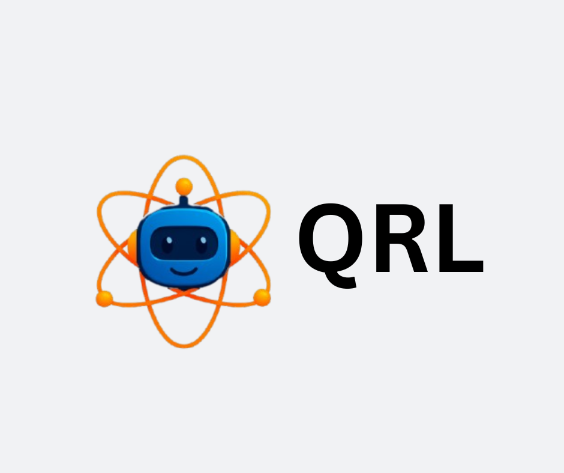
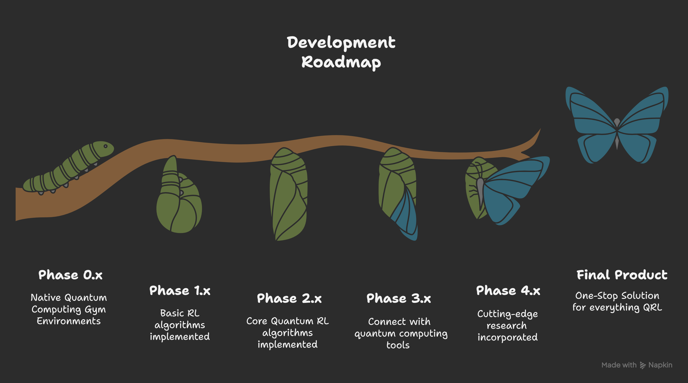

### qrl-qai: The quantum analogue of OpenAI's gym python framework 
 

---

**qrl-qai** is a python framework built on top of **Gymnasium**, **PennyLane**, and **PyTorch** to serve as a central platform for everything **quantum reinforcement learning**.

The current release (0.2.0) offers 5 native quantum RL style environments - **BlochSphereV0**, **CompilerV0**, **ErrorChannelV0**, **ExpressibilityV0**, **ProbabilityV0**. 

Each significant release has an asssociated Google Colab and Lightning AI Studio template to help users experiment faster (see the table below). Lightning AI Studio has additional Streamlit based webapp for no-code experimentation and is recommended!

| Version | Google Colab | Lightning AI Studio |
|----------|--------------|--------------------|
| **0.1.0** | - | - |
| **0.2.0** | [](https://colab.research.google.com/drive/1vtPB5_KRVkD3-4iiku4X8EmMpr_PoOY2?usp=sharing) | [](https://lightning.ai/jayshah25/studios/qrl-qai-0-2-0-playground) |

---

## 📑 Table of Contents
- [Roadmap](#-roadmap)  
- [Installation](#-installation)   
- [Contributing](#-contributing)  
- [License](#-license)  
- [Contact](#-contact)  

---

## 🗺 Roadmap
  

---

## 🚀 Installation

Install the package directly from PyPI:

```bash
pip install qrl-qai
```
To save the episodes as `mp4` videos, it is essential to have `ffmpeg` installed on your system. In the absence of ffmpeg, you can run the environments but save the episodes as `gif` only and not `mp4`. 

To check if you have ffmpeg installed (Windows/Linux/Mac), you can try:

```bash
ffmpeg -version
```

To install ffmpeg, you can follow these steps:

### Using Conda

You can also install FFmpeg within a conda environment:

```bash
conda install -c conda-forge ffmpeg
```

### Windows

Option 1: Using Chocolatey (Recommended)

If you have Chocolatey installed:

```bash
choco install ffmpeg
```

✅ Option 2: Manual installation

1. Go to the [official FFmpeg site](https://ffmpeg.org/download.html) → Click Windows → gyan.dev builds or BtbN builds.

2. Download the latest release full build ZIP.

3. Extract it (e.g., to C:\ffmpeg).

4. Add the bin folder to your PATH:

   4.1 Press Win + R → sysdm.cpl → Advanced → Environment Variables

   4.2 Edit Path → Add new entry: C:\ffmpeg\bin

### Linux

Debian / Ubuntu:

```bash
sudo apt update
sudo apt install ffmpeg -y
```

Fedora:

```bash
sudo dnf install ffmpeg -y
```

Arch Linux:

```bash
sudo pacman -S ffmpeg
```

### macOS

Using Homebrew:

```bash
brew install ffmpeg
```

## 🤝 Contributing

Contributions are welcome! 🎉

See our CONTRIBUTING.md for guidelines.

## 📜 License

This project is licensed under the Apache 2.0 License

## 📬 Contact

Initiated by [Jay Shah](https://www.linkedin.com/in/jay-shah-qml/)

Email: jay.shah@qrlqai.com
