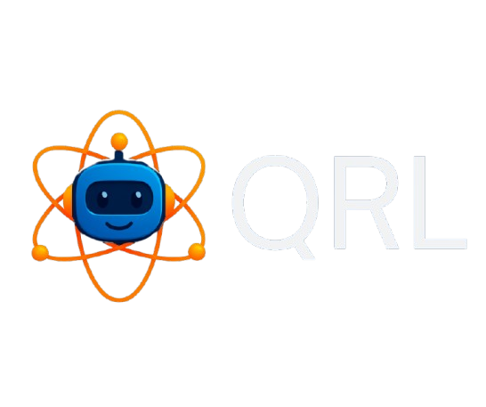

# Quantum-Reinforcement-Learning

**`quantum-reinforcement-learning`** is a python module built on top of gymansium, pennylane and pytorch frameworks. 

This framework was created by Jay Shah as a side personal project.

## Objectives of this project

1. Develop a python module that can serve as a central platform for experimentation of quantum reinforcement learning

2. Create a python module that can be used to test quantum agents against classical agents

3. Incorporate native quantum environments

4. Provide abstractions to simplify quantum reinforcement learning research

## References

* "Deep Reinforcement Learning Hands-On" (Third Edition) by Maxim Lapan.  