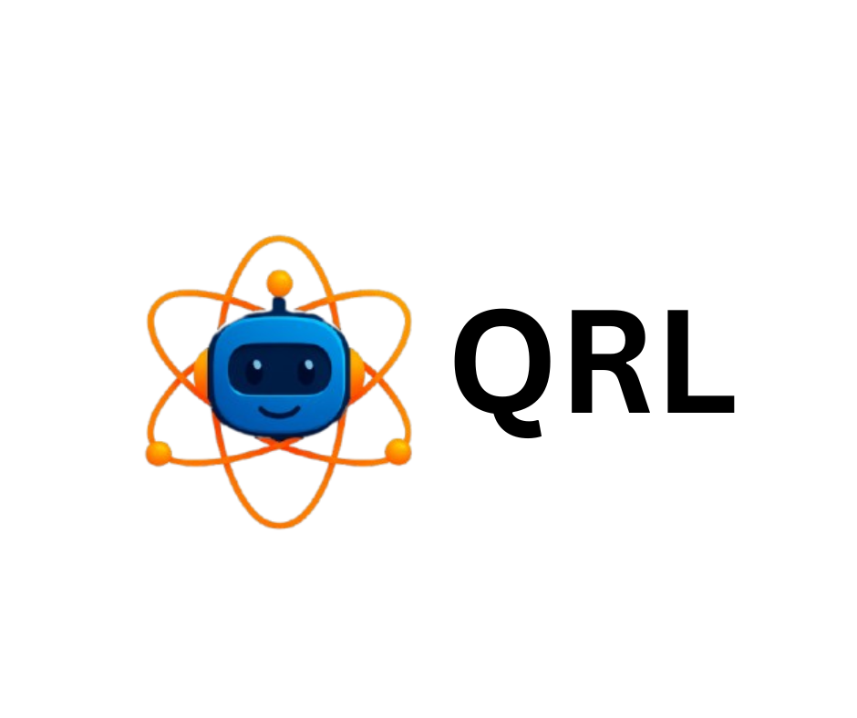

[](https://pypi.org/project/qrl-qai/)


[](https://github.com/Jayshah25/Quantum-Reinforcement-Learning)


### qrl-qai: The quantum analogue of OpenAI's gym python framework 
 

---

**qrl-qai** is a python framework built on top of **Gymnasium**, **PennyLane**, and **PyTorch** to serve as a central platform for everything **quantum reinforcement learning**.

The current release (0.3.0) offers 5 native quantum RL style environments:

* **BlochSphereV0**
* **CompilerV0**
* **ErrorChannelV0**
* **ExpressibilityV0**
* **ProbabilityV0**

Check out the [Quickstart](https://qrl-qai.readthedocs.io/en/v0.3.0/getting_started/quickstart.html) guide to get started.

Additionally, each significant release has an asssociated Google Colab and Lightning AI Studio for a hassle free experience. These are especially useful for users who want to quickly test out the environments without going through the installation process.

Lightnining AI Studio contains a Streamlit playground for no-code experimentation with the environments!

| Version | Google Colab | Lightning AI Studio | Documentation |
|----------|--------------|--------------------|---------------|
| **0.1.0** | - | - | [Read The Docs](https://qrl-qai.readthedocs.io/en/v0.1.0/)|
| **0.2.0** | [](https://colab.research.google.com/drive/1vtPB5_KRVkD3-4iiku4X8EmMpr_PoOY2?usp=sharing) | [](https://lightning.ai/jayshah25/studios/qrl-qai-0-2-0-playground) | [Read The Docs](https://qrl-qai.readthedocs.io/en/v0.2.0/)|
| **0.3.0** | - | - | [Read The Docs](https://qrl-qai.readthedocs.io/en/v0.3.0/)|

---

## 📑 Table of Contents
- [Roadmap](#-roadmap)  
- [Installation](#-installation)   
- [Contributing](#-contributing)  
- [License](#-license)  
- [Contact](#-contact)  

---

## 🗺 Roadmap
  

---

## 🚀 Installation

Install the package directly from PyPI:

```bash
pip install qrl-qai
```
To save the episodes as `mp4` videos, it is essential to have `ffmpeg` installed on your system. In the absence of ffmpeg, you can run the environments but save the episodes as `gif` only and not `mp4`. 

To check if you have ffmpeg installed (Windows/Linux/Mac), you can try:

```bash
ffmpeg -version
```

To install ffmpeg, you can follow these steps:

### Using Conda

You can also install FFmpeg within a conda environment:

```bash
conda install -c conda-forge ffmpeg
```

### Windows

Option 1: Using Chocolatey (Recommended)

If you have Chocolatey installed:

```bash
choco install ffmpeg
```

✅ Option 2: Manual installation

1. Go to the [official FFmpeg site](https://ffmpeg.org/download.html) → Click Windows → gyan.dev builds or BtbN builds.

2. Download the latest release full build ZIP.

3. Extract it (e.g., to C:\ffmpeg).

4. Add the bin folder to your PATH:

   4.1 Press Win + R → sysdm.cpl → Advanced → Environment Variables

   4.2 Edit Path → Add new entry: C:\ffmpeg\bin

### Linux

Debian / Ubuntu:

```bash
sudo apt update
sudo apt install ffmpeg -y
```

Fedora:

```bash
sudo dnf install ffmpeg -y
```

Arch Linux:

```bash
sudo pacman -S ffmpeg
```

### macOS

Using Homebrew:

```bash
brew install ffmpeg
```

## 🤝 Contributing

See our CONTRIBUTING.md for guidelines.

## 📜 License

This project is licensed under the Apache 2.0 License

## 📬 Contact

Initiated by [Jay Shah](https://www.linkedin.com/in/jay-shah-qml/)

Email: jay.shah@qrlqai.com
